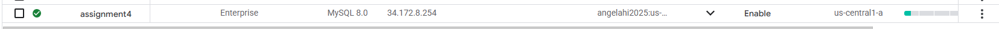
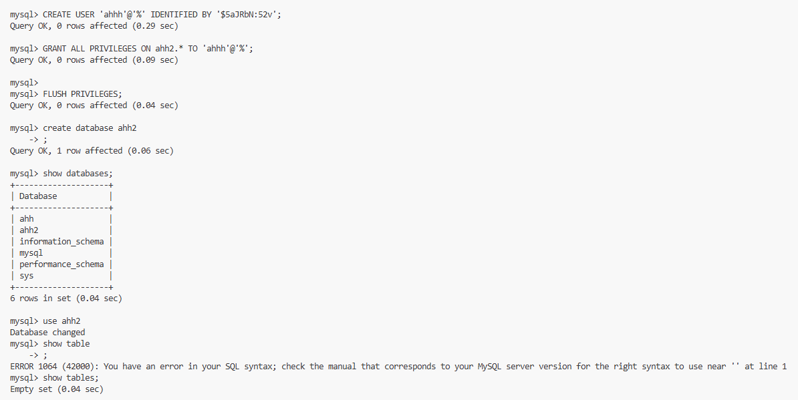
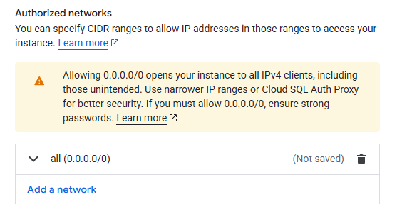
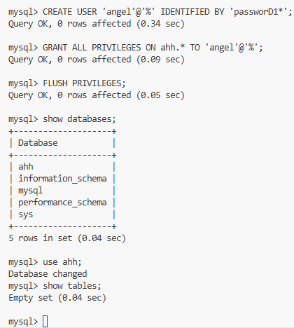
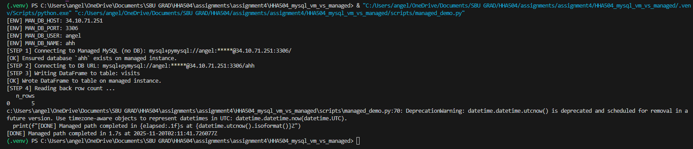
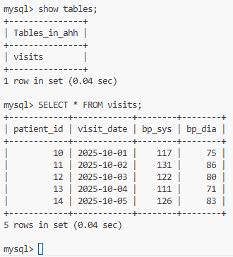

# HHA504 Assignment 4: MySQL on VM vs Managed Service (SQLAlchemy + pandas)

## Overview
The task of this assignment is to provision two MySQL databases on the same cloud: (A) a VM to harden and configure, and (B) the cloud’s managed MySQL offering. Then, connect to both using SQLAlchemy in Python, create a new database and table with pandas, insert data, and read it back.

**Cloud and Region**
Cloud: Google Cloud Platform
VM Zone: us-central1-c
Cloud SQL Region: 

## Video recording 
- Zoom video: [link](https://drive.google.com/file/d/1CFQDkMXV1dFcFITAaMKnR8jDE-ipBkay/view?usp=sharing)

## Steps 
### VM:
1. Create a VM 
   * OS: Ubuntu LTS or Oracle Linux
   * Instance type: small (e.g., 1–2 vCPU, 2–4 GB RAM)
2. Create a Firewall Rule for port 3306
3. Install & Configure MySQL
   * Install server packages; enable and start service
   * Set strong root password (or auth plugin)
   * Edit `mysqld.cnf` (bind-address = 0.0.0.0), restart service
   * Configure firewall/security group rules minimally; note your choices in `setup_notes_vm.md`
3. **Test Locally or Inside of Cloud Console (VS Code in GCP) environment **
   * `mysql -u <user> -p -h 127.0.0.1 -P 3306` from VM
   * Optional: set up an SSH tunnel from your dev machine instead of opening 3306 publicly
### Managed:
1. Create the provider’s managed MySQL with a small tier
   * Engine version, vCPU/RAM tier
   * Network model (public IP allowlist)
   * Initial admin user, DB name
   * Any automatic backups/HA configuration chosen

## Screenshots
### VM

 
 
 
 
 
 

### Managed 

