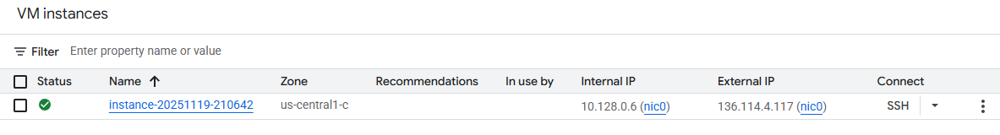
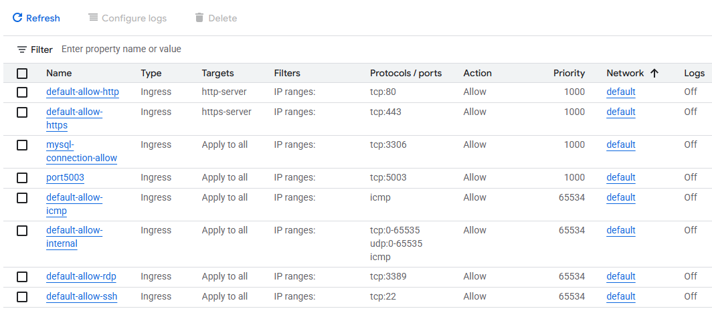
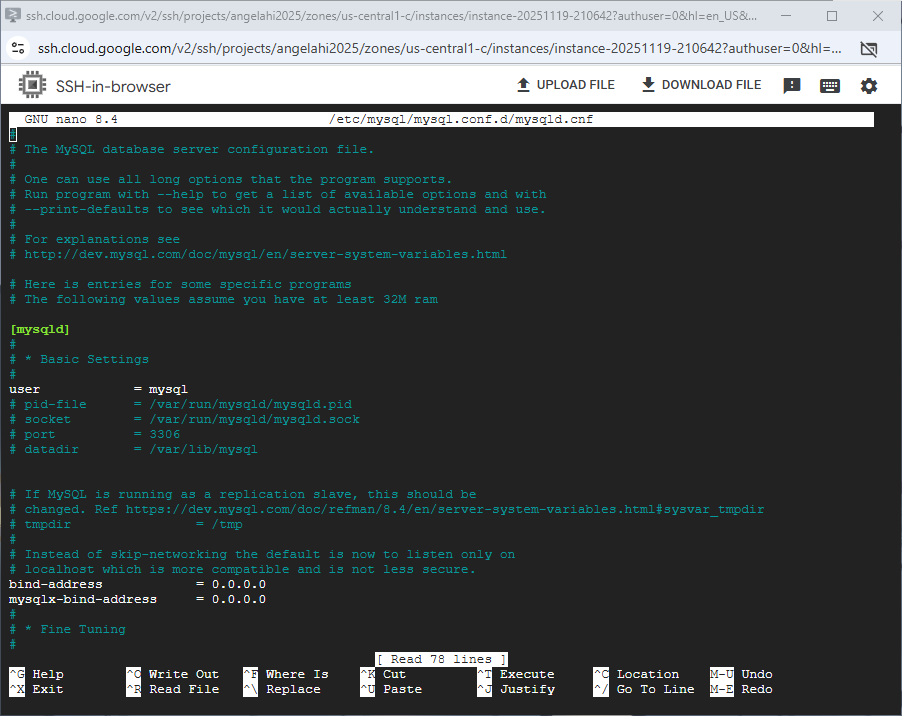
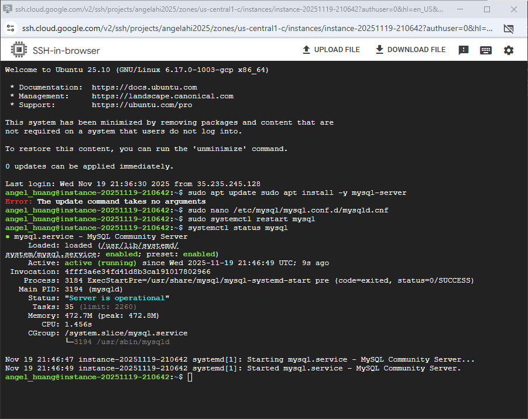
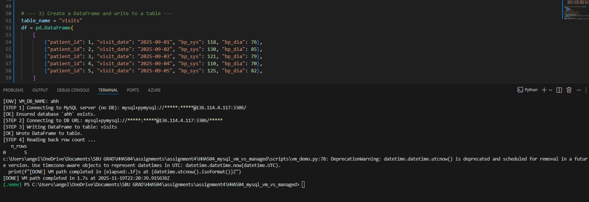
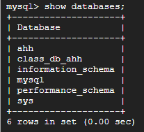
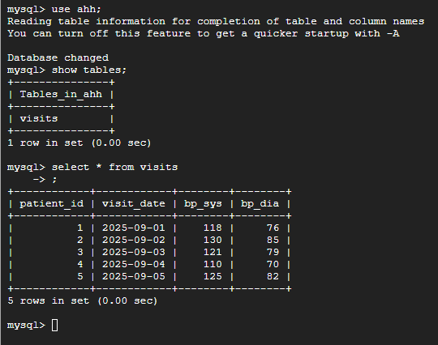

# Setup steps for vm mysql
## VM creation
1. Click on "Create a VM"
2. Give it a name
3. Select the region and zone of your preference
4. Select E2 and choose e2-small
5. Go to OS and storage and select Ubuntu OS system.
6. Everything else will be kept at default
7. Create VM

## Firewall configuration
1. Create a firewall rule
2. Give it a name
3. Fill in IP range to 0.0.0.0/0 to allow all IPs
4. Fill in protocol to tcp: 3306

## SSH steps
1. Go back to VM instances
2. Chick on SSH and authorize
3. Enter `sudo apt-get update` to update the OS system
4. Enter `sudo apt install mysql-server mysql-client -y` to install mysql
5. Enter `sudo mysql` for mysql log in
6. Enter `CREATE USER 'xxx'@'%' IDENTIFIED BY 'xxx';` to add create a new user to database
7. Enter `GRANT ALL PRIVILEGES ON *.* TO 'xxx'@'%' WITH GRANT OPTION;` to give all privileges to the user
8. Close and reopen SSH and enter `sudo apt install nano`
9. Enter `sudo nano /etc/mysql/mysql.conf.d/mysqld.cnf`
10. Change the bind-address and mysqlx-bind-address to `0.0.0.0/0`

11. Researt SSH with `sudo systemctl restart mysql` and check status using `systemctl status mysql`

12. Enter `mysql -u xxx -p` to locally test the user connection to mysql
13. Enter the password you set to the username

## Total time
 ~50 minutes